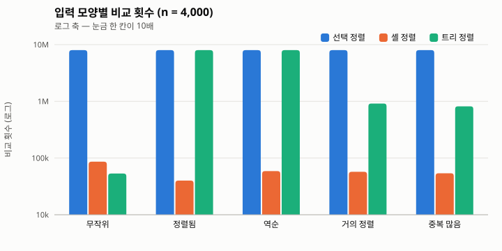
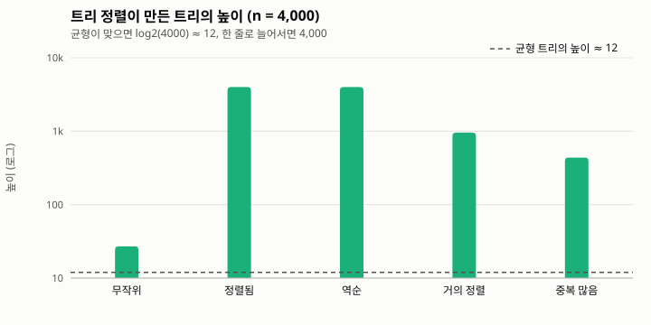
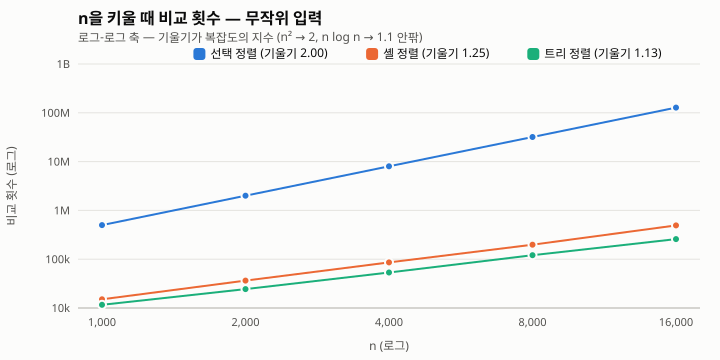
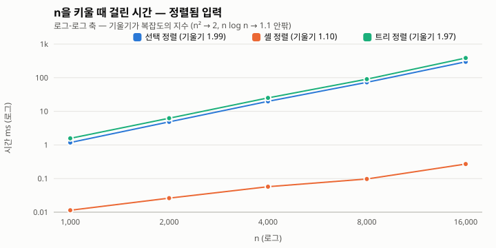

# 과제 1. 정렬 비교 — 선택 정렬 · 셸 정렬 · 트리 정렬

| 항목 | 내용 |
| --- | --- |
| 과목 | 2026-2 고급알고리즘 (SIT2001-01) |
| 학번 / 이름 | (작성) |
| GitHub 저장소 | <https://github.com/jubchakjue/algorithm_hw1> |
| 비교 대상 | 배운 정렬 ① **선택 정렬** · 배운 정렬 ② **셸 정렬** · 배우지 않은 정렬 **트리 정렬(Tree sort)** |
| 실행 | `make run` (예제) · `make test` (유닛 테스트) · `make bench` (비교 표) · `make charts` (그래프) |
| 환경 | 저장소의 `lab` 컨테이너, `gcc -std=c17 -Wall -Wextra -O2`, Python 3 |

---

## 1. 개요

세 정렬을 C와 Python으로 같은 방식으로 구현하고, **같은 입력 · 같은 잣대**로 재서
비교했다. 시간은 기계에 따라 흔들리므로 **비교 횟수 · 이동 횟수**를 함께 센다.
세는 규칙은 강의 예제(`algorithm-code`의 `selectionSort.c`, `shellSort.c`)와 같다.

- **비교**: 원소끼리 크기를 견준 횟수
- **이동**: 원소를 한 번 옮겨 적은 횟수. 교환 한 번은 `temp`를 거치므로 3회
- **추가 메모리**: 입력 배열 밖에 `malloc`으로 잡은 바이트 (지역 변수는 세지 않음)
- **트리 높이**: 트리 정렬이 만든 이진 탐색 트리의 층 수

결론부터 적으면 다음과 같다.

| | 선택 정렬 | 셸 정렬 | 트리 정렬 |
| --- | --- | --- | --- |
| 무작위 입력 (n = 16,000) | 323.9 ms | **1.7 ms** | 2.0 ms |
| 정렬된 입력 (n = 16,000) | 297.5 ms | **0.3 ms** | 385.2 ms (최악) |
| 추가 메모리 | 0 | 0 | 16n 바이트 |
| 안정성 (실측) | 불안정 | 불안정 | **안정** |

트리 정렬은 무작위 입력에서는 `O(n log n)`으로 셸 정렬과 비슷하게 빠르지만,
**이미 정렬된 입력에서는 트리가 한 줄로 늘어서 선택 정렬보다도 느려진다.**
셋 중 유일한 안정 정렬이라는 장점은 `O(n)` 메모리를 내고 얻은 것이다.

---

## 2. 알고리즘 설명

### 2.1 선택 정렬 (배운 정렬)

남은 구간에서 최솟값을 찾아 맨 앞과 맞바꾸는 일을 `n-1`번 되풀이한다.

- 최솟값을 찾으려면 남은 구간을 **끝까지** 훑어야 한다. 그래서 비교 횟수가 입력과
  상관없이 항상 `n(n-1)/2`이다. 정렬된 입력이 와도 빨라지지 않는다.
- 대신 교환은 바깥 반복 한 번에 최대 1번이라 **이동이 `O(n)`으로 가장 적다.**
- 멀리 떨어진 두 원소를 맞바꾸므로 **불안정**하다.
  예: `(2,a) (2,b) (1,c)` → `(1,c) (2,b) (2,a)` — `a`와 `b`의 순서가 뒤집힌다.

### 2.2 셸 정렬 (배운 정렬)

간격(gap)만큼 떨어진 원소들끼리 삽입 정렬을 해 두고, 간격을 줄여 가며 되풀이한다.
마지막 간격 1은 보통의 삽입 정렬이지만, 그때는 배열이 이미 거의 정렬되어 있어
조금만 밀면 된다. 간격은 강의 예제와 같이 `n/2`부터 절반씩 줄인다(10개면 5, 2, 1).

- 삽입 정렬의 약점(원소가 한 칸씩만 움직임)을, 멀리 뛰는 앞 단계로 메운다.
- 시간 복잡도는 간격 수열에 따라 다르다. 이 수열(Shell의 원래 수열)은 최악
  `O(n²)`이지만, 무작위 입력에서는 실측 기울기가 1.25로 `O(n²)`보다 훨씬 낫다.
- 멀리 뛰면서 같은 값의 순서가 바뀔 수 있어 **불안정**하다.
  예: 키가 `0 1 0 0`인 입력 → 간격 2 단계에서 네 번째 `0`이 `1`의 자리로 뛰어
  세 번째 `0`보다 앞에 선다(`tests/test_sort.py`의 `test_shell_sort_is_unstable`).

### 2.3 트리 정렬 (배우지 않은 정렬)

**이진 탐색 트리(BST)에 원소를 모두 넣은 뒤, 중위 순회로 꺼내면 오름차순이 된다**는
성질을 그대로 정렬에 쓴다.

1. **삽입** — 첫 원소를 뿌리로 둔다. 다음 원소부터는 뿌리에서 시작해, 노드보다
   작으면 왼쪽, 크거나 같으면 오른쪽으로 내려가다가 빈 자리에 매단다.
2. **순회** — 왼쪽 서브트리 → 자기 자신 → 오른쪽 서브트리 순으로 방문하며 값을
   배열에 차례로 적는다.

예제 배열 `6 8 5 9 10 1 7 2 4 3`을 넣으면 트리는 다음과 같다.

```text
                6
              /   \
             5     8
            /     / \
           1     7   9
            \         \
             2         10
              \
               4
              /
             3
```

중위 순회: `1 2 3 4 5 6 7 8 9 10`. 비교는 원소마다 "내려간 깊이"만큼이라
합이 23회다(선택 정렬은 45회).

**성능은 트리의 모양이 정한다.**

| 경우 | 트리 모양 | 높이 | 비교 횟수 |
| --- | --- | --- | --- |
| 무작위 입력 (평균) | 대체로 고르게 퍼짐 | `O(log n)` | 약 `2n ln n ≈ 1.39 n log₂ n` |
| 정렬된 · 역순 입력 (최악) | **한쪽으로 늘어선 한 줄** (연결 리스트와 같음) | `n` | `n(n-1)/2` |

정렬된 입력에서는 새 원소가 늘 가장 크므로 매번 오른쪽 끝까지 내려가야 한다.
그래서 **퀵 정렬의 최악과 같은 모양**이 된다. 뿌리를 첫 피벗으로 보면, 첫 원소를
피벗으로 고르는 퀵 정렬과 같은 쌍을 비교하기 때문이다.

**안정성** — 같은 값을 **오른쪽**으로 보내면, 나중에 들어온 같은 값은 항상 더
오른쪽에 매달려 중위 순회에서 뒤에 나온다. 그래서 입력 순서가 지켜진다.
조건 하나(`<` 대신 `<=`로 쓰면 같은 값이 왼쪽으로 감)가 안정성을 가른다.

**메모리** — 원소마다 노드(값 + 자식 두 개)를 새로 잡으므로 `O(n)`이 든다. 제자리
정렬인 선택 · 셸 정렬과 가장 크게 다른 점이다.

**보완책** — 최악을 없애려면 트리의 균형을 잡는다. AVL 트리나 레드-블랙 트리 같은
**자가 균형 BST**를 쓰면 높이가 항상 `O(log n)`이라 최악도 `O(n log n)`이 된다.
위키피디아 비교표의 트리 정렬 행이 최악 `n log n`인 것은 이 균형 트리를 가정한
값이다. 이 과제에서는 알고리즘의 본모습을 보려고 **균형을 잡지 않은 기본형**을
구현했다.

### 2.4 이론 비교 (위키피디아 비교표 기준)

| 정렬 | 최선 | 평균 | 최악 | 추가 메모리 | 안정 | 방식 |
| --- | --- | --- | --- | --- | :---: | --- |
| 선택 정렬 | n² | n² | n² | 1 | X | 선택 |
| 셸 정렬 (간격 n/2) | n log n | 간격 수열에 따라 다름 | n² | 1 | X | 삽입 |
| 트리 정렬 (기본형) | n log n | n log n | **n²** | n | O | 삽입 |
| 트리 정렬 (균형 트리) | n log n | n log n | n log n | n | O | 삽입 |

---

## 3. AI를 통한 트리 정렬 학습 기록

트리 정렬은 수업에서 다루지 않아 AI(Claude)에게 질문하며 익혔다. 질문과 답의
요지를 정리하고, **답을 그대로 믿지 않고 코드와 실험으로 확인한 결과**를 함께 적는다.

| # | 질문 | AI 답변 요지 | 직접 확인한 것 |
| --- | --- | --- | --- |
| 1 | 트리 정렬은 어떤 알고리즘인가? | BST에 모두 삽입하고 중위 순회로 꺼낸다. BST의 "왼쪽 < 노드 ≤ 오른쪽" 성질 때문에 중위 순회 결과가 곧 정렬 결과다. | 2.3절 예제 트리를 손으로 그려 보고, 구현이 같은 결과(비교 23회)를 내는 것을 C · Python 양쪽 테스트로 확인 |
| 2 | 시간 복잡도는? | 평균 `O(n log n)`, 균형을 잡지 않으면 최악 `O(n²)`. 최악은 정렬된 입력처럼 트리가 한 줄로 늘어설 때. | 정렬된 입력에서 높이 = n, 비교 = n(n-1)/2를 테스트로 고정. 5.2절에서 무작위 비교 횟수의 기울기 1.13, 정렬된 입력의 시간 기울기 1.97 |
| 3 | 무작위 입력의 비교 횟수를 더 정확히 말하면? | 무작위 BST의 평균 삽입 비교 합은 `2(n+1)Hₙ − 4n ≈ 1.39 n log₂ n`. 퀵 정렬 평균 비교와 같은 식이다. | n = 16,000에서 식의 값 264,263 대 실측 257,950 (차이 2.4%) |
| 4 | 안정 정렬인가? | 같은 키를 한쪽(오른쪽)으로 일관되게 보내면 안정이다. | `(key, tag)` 레코드로 실측 — 트리만 안정, 선택 · 셸은 불안정 (5.3절) |
| 5 | 메모리는? | 노드마다 값과 포인터 2개가 필요해 `O(n)`. 제자리 정렬이 아니다. | 노드 12바이트 + 순회 스택 4바이트 = 원소당 16바이트. n = 16,000에서 256,000바이트 |
| 6 | 구현에서 조심할 점은? | 재귀로 삽입 · 순회하면 한 줄짜리 트리에서 재귀 깊이가 n이 되어 스택이 넘칠 수 있다. 반복문과 명시적 스택을 쓰라. | 삽입 · 순회를 모두 반복문으로 작성. Python 기본 재귀 한도(1000)를 넘는 n = 3,000 정렬 입력을 테스트로 통과 |
| 7 | 중복 값이 많으면? | (추가 질문) 같은 값이 전부 오른쪽 사슬로 이어지므로 **중복이 많으면 트리가 길어진다.** 노드에 개수(count)를 두거나 같은 값을 리스트로 묶으면 피할 수 있다. | 값이 0~9뿐인 입력에서 트리 높이 437 (무작위는 27). 비교 816,583회는 "값 10가지 × 각 400개의 사슬" 추정치 10 × 400²/2 = 800,000과 맞는다 (5.1절) |
| 8 | 실제로 쓰이나? | 정렬만을 위해 쓰는 일은 드물다(메모리 · 캐시 비효율). 대신 **데이터가 계속 들어오면서 언제든 정렬된 상태를 봐야 할 때**(온라인 정렬), 균형 트리 기반 자료구조(C++ `std::map`, Java `TreeMap`)가 사실상 트리 정렬을 하고 있다. | n = 16,000 무작위 입력에서 비교는 셸 정렬보다 48% 적은데 시간은 16% 더 걸렸다 — 노드를 따라 메모리를 건너뛰는 비용 (5.2절) |

**배운 점** — 트리 정렬은 "정렬 알고리즘"이라기보다 **자료구조(BST)의 성질을 정렬에
쓴 것**이다. 그래서 성능이 전적으로 자료구조의 모양(높이)에 달려 있고, 입력 순서가
그 모양을 정한다. AI의 답 중 복잡도 · 안정성 · 재귀 위험은 실험과 정확히 맞았고,
7번(중복 값 문제)은 처음 질문에서는 나오지 않다가 실험 결과를 보고 다시 물어서
알게 된 것이다. AI의 설명을 실험으로 확인하는 과정이 필요했던 이유다.

---

## 4. 구현과 실험

### 4.1 코드 구조

```text
src/    sort.h · sort.c(정렬 표) · selectionSort.c · shellSort.c · treeSort.c
        bench.h · bench.c(입력 생성 · 시간 측정) · main.c(예제 · --bench · --csv)
        sort.py · main.py(같은 알고리즘의 Python 구현 · 안정성 실측)
tests/  test_sort.c(C 39개, 표준 C만) · test_sort.py(Python 9개, unittest)
tools/  plot.py · svgchart.py(CSV → SVG 그래프, 표준 모듈만)
report/ REPORT.md · results.csv(측정 원본) · *.svg
```

세 정렬은 모두 `void xxxSort(int a[], int n, SortStats *stats)` 모양이다. 그래서
`SORT_ALGORITHMS` 표에 한 줄씩 넣어 두면 벤치마크와 테스트가 표를 훑으며
**똑같은 조건**으로 부른다.

`SortStats`에는 비교 · 이동 횟수, 추가 메모리, 트리 높이를 담는다. 강의 예제는 `int`로
셌지만 n = 16,000에서 선택 정렬의 비교가 1억 2천만 회를 넘으므로 `long long`을 썼다.

**트리 정렬 구현의 선택**

| 고민 | 고른 것 | 이유 |
| --- | --- | --- |
| 노드 할당 | `malloc` 한 번으로 노드 n개를 배열째 | 원소마다 `malloc`하면 n번 호출하고 n번 해제해야 한다 |
| 자식 연결 | 포인터 대신 **인덱스**(`int left, right`) | 노드 배열 안의 자리만 가리키면 된다. 없으면 `-1` |
| 삽입 · 순회 | **반복문**, 순회는 명시적 스택(n칸) | 정렬된 입력에서 높이 n → 재귀면 스택 넘침 |
| 같은 값 | 오른쪽으로 (`key < node` 이면 왼쪽) | 안정 정렬이 된다 |

```c
/* src/treeSort.c — 삽입 한 번 */
int cur = 0;
for (;;) {
    stats->comparisons++;
    int *child = key < nodes[cur].key ? &nodes[cur].left : &nodes[cur].right;
    if (*child == NIL) { *child = i; break; }
    cur = *child;
}
```

### 4.2 검증

`make test`는 C 테스트 39개와 Python 테스트 9개를 모두 돌리며, 전부 통과한다.

| 검사 | 내용 |
| --- | --- |
| 기본 케이스 | 섞임 · 정렬됨 · 역순 · 중복 · 모두 같은 값 · 음수 · 원소 1개 · 빈 배열 |
| `qsort` 대조 | 입력 모양 5가지 × 크기 n = 0..200 전부를 표준 라이브러리 결과와 비교 |
| 센 값 | 예제 배열의 비교 · 이동 횟수(45/15, 29/57, 23/20)를 **C와 Python이 같은 숫자로** 검사 — 두 구현이 같은 방식으로 센다는 증거 |
| 이론값 | 선택 정렬 비교 = n(n-1)/2, 트리 정렬 최악 높이 = n, 이동 = 2n, 메모리 = 16n |
| 안정성 | Python에서 `(key, tag)` 레코드를 key로만 정렬해 tag 순서를 확인 |

추가로 C 테스트를 **ASan · UBSan**(`-fsanitize=address,undefined`)으로 빌드해 돌려
메모리 오류와 정의되지 않은 동작이 없음을 확인했다. `make run`에서는 C와 Python이
같은 결과(정렬 결과와 비교 · 이동 횟수)를 찍는다.

### 4.3 실험 방법

- 입력 5가지: **무작위**(0 이상 10n 미만) · **정렬됨** · **역순** · **거의 정렬**(정렬된
  배열에서 n/100+1 쌍을 맞바꿈) · **중복 많음**(값 0~9만)
- 씨앗을 고정한 xorshift로 만들어 언제 돌려도 같은 입력이 나온다.
  그래서 **비교 · 이동 횟수는 재현되고, 시간만 기계에 따라 조금씩 달라진다.**
- 시간은 `clock()`으로 정렬 구간만(입력 복사 제외) 잰다. 적어도 3번, 그리고 합이
  20ms를 넘을 때까지 되풀이해 평균낸다. 0.05ms짜리 정렬은 한 번만 재면 `clock()`의
  눈금에 묻히기 때문이다(실제로 몇백 번 돈다 — CSV의 `reps` 열).
- 아래 숫자는 모두 한 번의 `make charts` 실행에서 나왔고, 원본은
  [`results.csv`](results.csv)에 있다.

---

## 5. 실험 결과

### 5.1 입력 모양별 (n = 4,000)

| 입력 | 알고리즘 | 시간(ms) | 비교 | 이동 | 트리 높이 |
| --- | --- | ---: | ---: | ---: | ---: |
| 무작위 | 선택 | 20.171 | 7,998,000 | 11,982 | – |
| 무작위 | 셸 | 0.350 | 86,154 | 128,178 | – |
| 무작위 | 트리 | **0.292** | 53,293 | 8,000 | 27 |
| 정렬됨 | 선택 | 15.464 | 7,998,000 | 0 | – |
| 정렬됨 | 셸 | **0.049** | 40,006 | 80,012 | – |
| 정렬됨 | 트리 | 22.707 | 7,998,000 | 8,000 | 4,000 |
| 역순 | 선택 | 17.189 | 7,998,000 | 6,000 | – |
| 역순 | 셸 | **0.070** | 58,816 | 102,812 | – |
| 역순 | 트리 | 25.156 | 7,998,000 | 8,000 | 4,000 |
| 거의 정렬 | 선택 | 20.218 | 7,998,000 | 123 | – |
| 거의 정렬 | 셸 | **0.187** | 57,240 | 97,305 | – |
| 거의 정렬 | 트리 | 2.928 | 913,808 | 8,000 | 957 |
| 중복 많음 | 선택 | 19.765 | 7,998,000 | 10,782 | – |
| 중복 많음 | 셸 | **0.170** | 53,873 | 95,537 | – |
| 중복 많음 | 트리 | 2.712 | 816,583 | 8,000 | 437 |



- **선택 정렬의 비교는 다섯 입력 모두 7,998,000 = 4000·3999/2로 똑같다.** 입력을
  전혀 타지 않는다. 막대 높이가 일직선인 것이 그 뜻이다.
- **트리 정렬은 입력을 가장 심하게 탄다.** 무작위에서는 셋 중 비교가 가장 적지만
  (53,293), 정렬됨 · 역순에서는 선택 정렬과 **정확히 같은** 7,998,000회가 된다.
  한 줄짜리 트리에 원소를 넣는 것은 남은 원소를 끝까지 훑는 선택 정렬과 같은
  일이기 때문이다.
- 셸 정렬은 정렬됨 · 역순에서 오히려 가장 빠르다. 각 간격 단계에서 원소가 거의
  움직이지 않는다.

- 시간([`shapes-time.svg`](shapes-time.svg))은 비교 횟수와 거의 같은 모양이다. 다만 **정렬됨 · 역순에서 트리
  정렬(22.7 · 25.2ms)이 선택 정렬(15.5 · 17.2ms)보다 약 1.5배 느리다.** 비교 횟수는
  똑같은데, 선택 정렬은 배열을 순서대로 읽고 트리 정렬은 노드를 따라 메모리를
  건너뛴다(캐시에 불리). 5.2절의 n별 측정에서도 다섯 번 모두 트리가 느렸다.
- 무작위에서는 트리 정렬(0.29ms)과 셸 정렬(0.35ms)이 비슷하다. 비교는 트리가 38%
  적지만 노드 접근과 `malloc` · `free` 비용이 그만큼을 까먹는다. 이 정도 차이는 측정마다
  순서가 뒤바뀔 수 있는 수준이다(5.2절의 같은 입력 n = 4,000에서는 0.34 대 0.28ms).



트리 높이가 곧 트리 정렬의 성능이다.

- 무작위: 27 — 균형 트리의 높이 log₂4000 ≈ 12의 약 2배. 완벽하진 않아도 `O(log n)`이다.
- 정렬됨 · 역순: 4,000 — 트리가 한 줄이다. 최악.
- 거의 정렬: 957 — 41쌍만 바꿨는데도 높이가 수백이다. **"조금 섞인 정렬 데이터"는
  실제로 흔하므로 균형을 안 잡은 트리 정렬에는 위험한 입력이다.**
- 중복 많음: 437 — 값이 10가지뿐이라 같은 값 약 400개가 오른쪽 사슬로 이어진다.
  AI 학습 기록 7번에서 다룬 문제로, 개수를 세는 노드로 고치면 높이가 10 안팎이 된다.

### 5.2 n을 키우며

**무작위 입력 — 비교 횟수**

| n | 선택 | 배수 | 셸 | 배수 | 트리 | 배수 | 트리 이론값 2(n+1)Hₙ−4n |
| ---: | ---: | ---: | ---: | ---: | ---: | ---: | ---: |
| 1,000 | 499,500 | – | 15,041 | – | 11,604 | – | 10,986 |
| 2,000 | 1,999,000 | ×4.00 | 36,409 | ×2.42 | 24,404 | ×2.10 | 24,730 |
| 4,000 | 7,998,000 | ×4.00 | 86,154 | ×2.37 | 53,293 | ×2.18 | 54,989 |
| 8,000 | 31,996,000 | ×4.00 | 198,319 | ×2.30 | 120,588 | ×2.26 | 121,051 |
| 16,000 | 127,992,000 | ×4.00 | 492,030 | ×2.48 | 257,950 | ×2.14 | 264,263 |



- 로그-로그 축에서는 직선의 **기울기가 복잡도의 지수**다.
  선택 **2.00**(`n²`), 셸 **1.25**, 트리 **1.13**(`n log n`은 이 구간에서 약 1.1).
- n이 2배가 될 때 선택 정렬은 정확히 4배, 트리 정렬은 2.1~2.3배로 는다.
- 트리 정렬의 실측은 무작위 BST의 이론값과 6% 안에서 맞는다 (n = 1,000에서 +5.6%, 나머지는 −0.4~−3.1%).

**정렬된 입력 — 걸린 시간 (ms)**

| n | 선택 | 셸 | 트리 | 트리 / 선택 |
| ---: | ---: | ---: | ---: | ---: |
| 1,000 | 1.179 | 0.011 | 1.574 | 1.33 |
| 2,000 | 4.866 | 0.026 | 6.251 | 1.28 |
| 4,000 | 19.806 | 0.057 | 25.085 | 1.27 |
| 8,000 | 72.937 | 0.097 | 90.504 | 1.24 |
| 16,000 | 297.529 | 0.270 | 385.197 | 1.29 |



- 트리 정렬의 기울기가 **1.97**로 선택 정렬(1.99)과 나란하다. 최악에서는 트리
  정렬도 `O(n²)` 알고리즘이라는 것이 그대로 보인다.
- 셸 정렬은 기울기 1.10으로, 정렬된 입력에서는 거의 `n log n`이다.
- n = 16,000에서 셸 정렬(0.27ms)과 트리 정렬(385ms)의 차이는 약 **1,400배**다.
  무작위에서는 1.2배(1.70 대 1.97ms)였다. **같은 알고리즘이 입력 순서 하나로 이만큼
  달라진다.**

### 5.3 안정성과 메모리

안정성은 `make run-py`에서 실측했다. 키가 0~9인 `(key, tag)` 레코드 1,000개를 키로만
정렬한 뒤, 같은 키끼리 입력 순서(tag)가 지켜졌는지 본다.

| 알고리즘 | 추가 메모리 (n = 16,000) | 제자리 | 안정성(실측) |
| --- | ---: | :---: | :---: |
| 선택 정렬 | 0 B | O | 불안정 |
| 셸 정렬 | 0 B | O | 불안정 |
| 트리 정렬 | 256,000 B (원소당 16 B) | X | **안정** |

트리 정렬은 셋 중 유일하게 안정하지만, 그 대가로 입력 크기에 비례하는 메모리를
쓴다. 원래 배열이 64,000바이트(`int` 16,000개)인데 추가 메모리가 그 4배다.

---

## 6. 결론

| 상황 | 가장 나은 선택 | 이유 |
| --- | --- | --- |
| 일반적인 무작위 데이터 | 셸 정렬 ≈ 트리 정렬 | 둘 다 `n²`보다 훨씬 낫다. 셸은 메모리가 0이라 더 무난하다 |
| 정렬 · 거의 정렬된 데이터 | **셸 정렬** | 트리 정렬은 최악(`n²`)에 빠진다 |
| 같은 키의 순서를 지켜야 할 때 | **트리 정렬** | 셋 중 유일한 안정 정렬 |
| 교환(쓰기) 횟수를 줄여야 할 때 | 선택 정렬 | 이동이 `O(n)` — 무작위 n = 4,000에서 11,982회로 가장 적다 |
| 메모리가 빠듯할 때 | 선택 · 셸 정렬 | 제자리 정렬 |

1. **선택 정렬**은 입력을 전혀 타지 않는다. 언제나 `n(n-1)/2`번 비교한다. 느리지만
   예측 가능하고, 쓰기가 가장 적다.
2. **셸 정렬**은 삽입 정렬에 "멀리 뛰기"를 더한 것만으로 모든 입력에서 가장 빨랐다.
   이번 실험의 종합 1위다.
3. **트리 정렬**은 평균 `O(n log n)`에 안정 정렬이라는 장점이 있지만, 성능이 트리의
   모양에 달려 있어 **정렬된 입력 · 중복이 많은 입력에서 크게 무너진다.** 실무에서
   쓰려면 균형 트리(AVL, 레드-블랙)와 중복 개수 세기가 필요하다. 정렬 알고리즘으로
   보다 **자료구조가 정렬 상태를 유지하는 원리**로 이해하는 것이 맞다는 것을 배웠다.

### 한계

- 트리 정렬은 균형을 잡지 않은 기본형만 구현했다. 균형 트리판과의 비교는 하지 않았다.
- 셸 정렬은 강의의 `n/2` 간격만 썼다. Knuth(1, 4, 13, …)나 Ciura 수열을 쓰면 더 빨라진다.
- 시간은 한 기계에서 잰 값이다. 그래서 재현되는 비교 · 이동 횟수를 함께 실었다.
- C는 `int` 배열이라 안정성을 Python에서만 실측했다.
